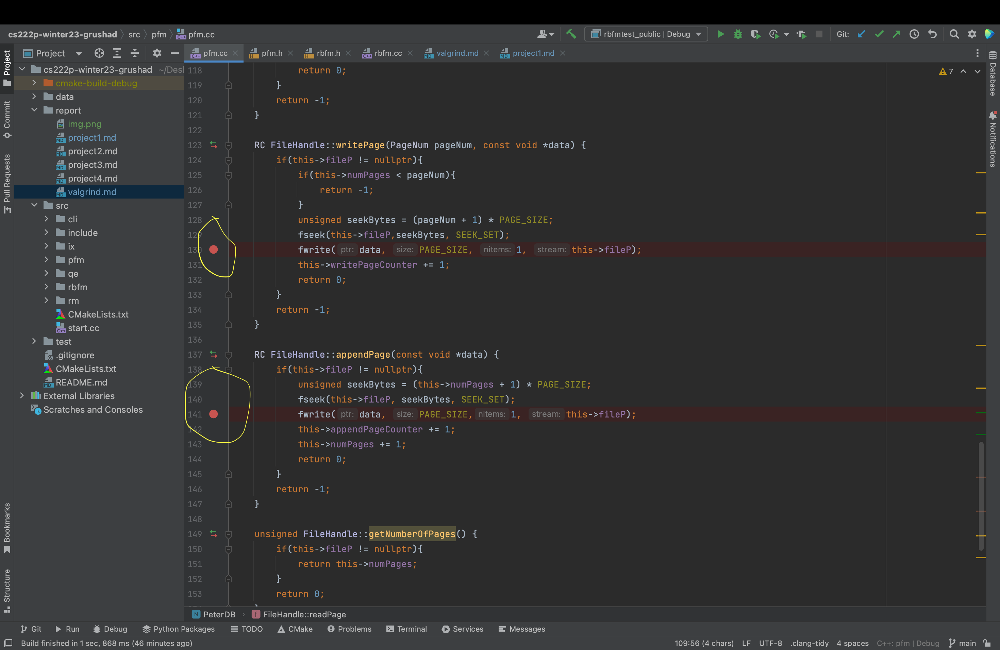
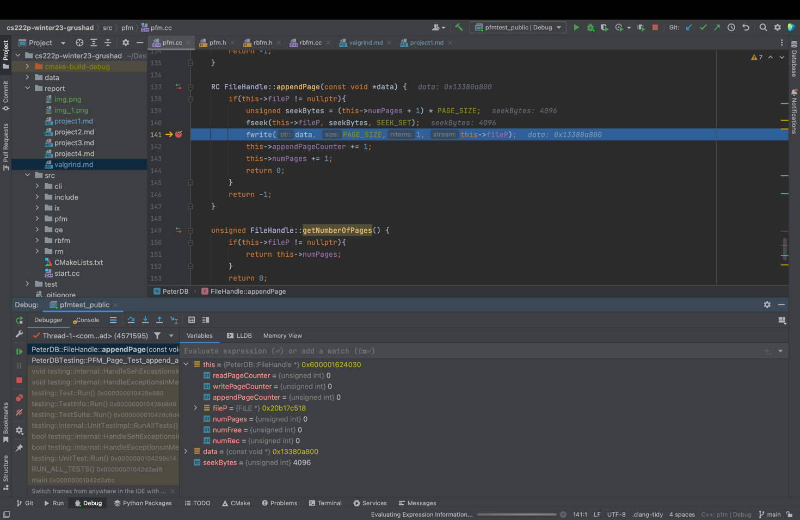

## Debugger and Valgrind Report

### 1. Basic information
- Team #: N/A
- Github Repo Link: https://github.com/UCI-Chenli-teaching/cs222p-winter23-grushad
- Student 1 UCI NetID: gdharod
- Student 1 Name: Grusha Jayesh Dharod

### 2. Using a Debugger
- Describe how you use a debugger (gdb, or lldb, or CLion debugger) to debug your code and show screenshots. 
For example, using breakpoints, step in/step out/step over, evaluate expressions, etc.
- We use a debugger to insert breakpoints in our code and check the value of the variables/objects at that time during execution.
- A lot of IDEs provide their own debugger where we can insert breakpoints at different lines in our code.
- Once the code is running the program flow will be normal until the breakpoint when it will stop running. 
- At the breakpoint we have to option to look at the variables and objects currently in use. Checking the values of these variables we can understand if there is a bug in our code.
- A debugger provides various features such as step in/step out/step over. So step in is when after the breakpoint there is a function call and if we need to step in that function and check debug the function as well.
- Step over allows the normal execution of the program, one statement at a time.

Adding breakpoints in the code -> indicated by red dots on the left side

State of the code while running it in debugger mode when it breaks at first breakpoint

### 3. Using Valgrind
- Describe how you use Valgrind to detect memory leaks and other problems in your code and show screenshot of the Valgrind report.